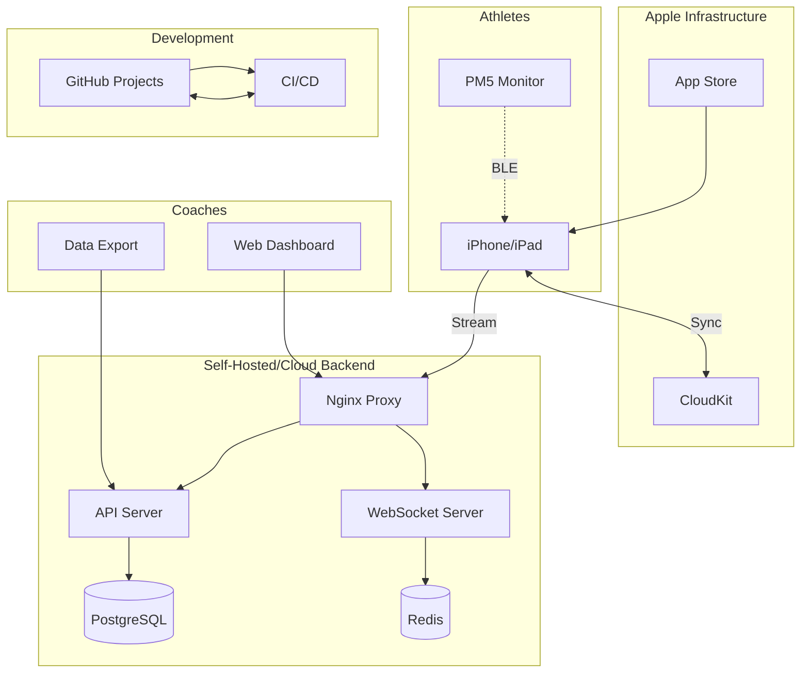
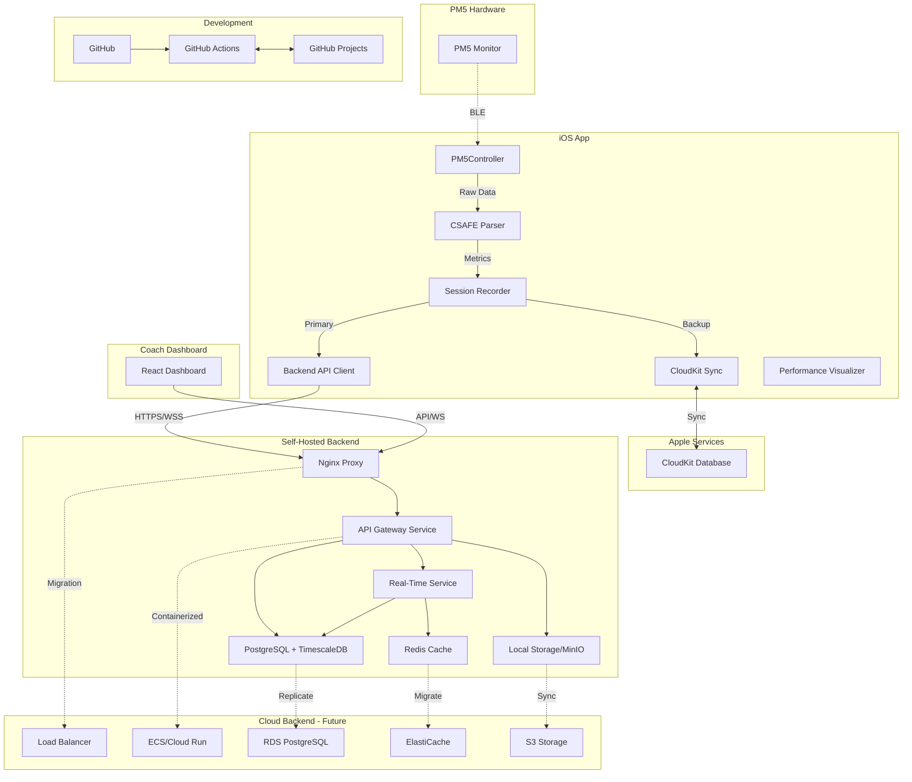
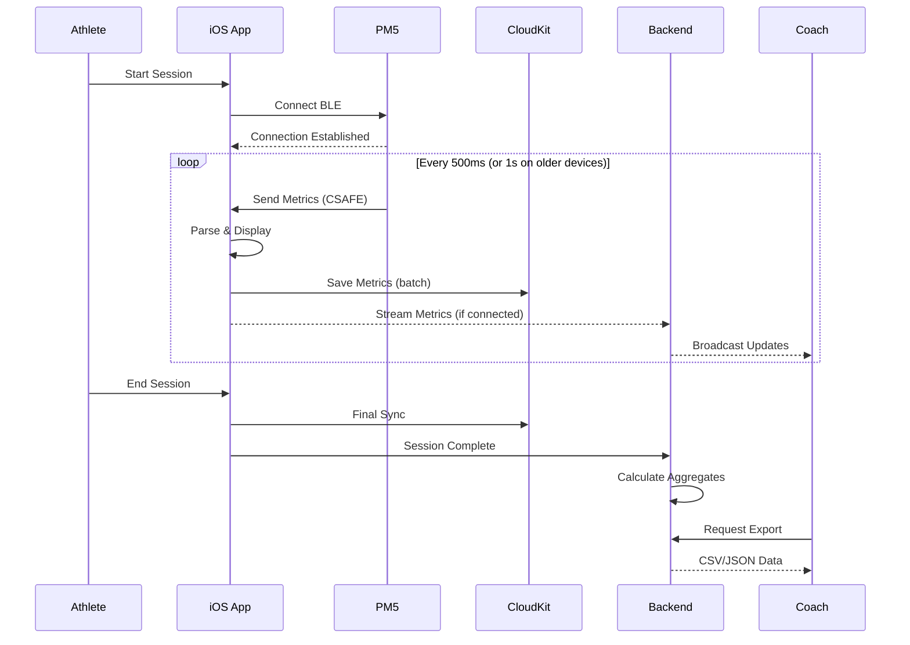
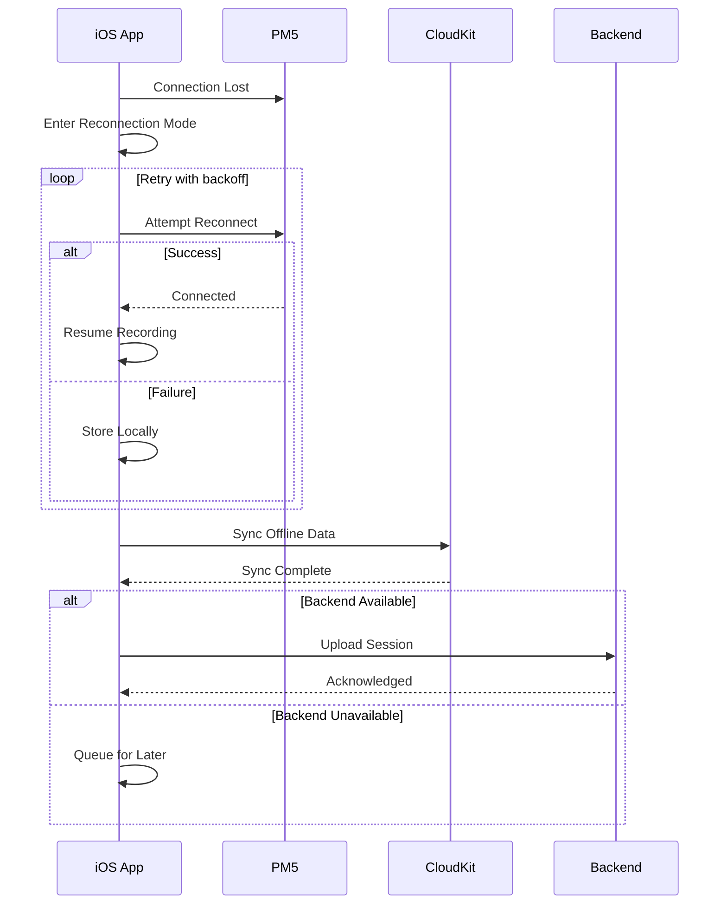

# Rowing Performance Tracking Platform - Fullstack Architecture Document

## Introduction

This document outlines the complete fullstack architecture for the Rowing Performance Tracking Platform, including backend systems, frontend implementation, and their integration. It serves as the single source of truth for AI-driven development, ensuring consistency across the entire technology stack.

This unified approach combines what would traditionally be separate backend and frontend architecture documents, streamlining the development process for modern fullstack applications where these concerns are increasingly intertwined.

### Starter Template or Existing Project
**Status:** Brownfield iOS project with existing PM5 BLE implementation

The project builds upon an existing iOS codebase that already includes:
- Complete PM5 BLE controller implementation (`d_n_w/PM5/`)
- CSAFE protocol parser for PM5 data
- Data models for all PM5 metrics
- Test view for PM5 connectivity

This existing foundation accelerates MVP development by providing proven BLE connectivity code.

### Change Log
| Date | Version | Description | Author |
|------|---------|-------------|---------|
| 2025-08-09 | 1.0 | Initial architecture document | Winston (Architect) |
| 2025-08-09 | 1.1 | Added self-hosting backend strategy | Winston (Architect) |
| 2025-08-09 | 1.2 | Integrated GitHub Projects management | Winston (Architect) |
| 2025-08-09 | 1.3 | Revised iOS versions for older device support | Winston (Architect) |

## High Level Architecture

### Technical Summary
The platform employs a hybrid architecture combining native iOS development with CloudKit for data persistence and an optional self-hosted/cloud backend for real-time coaching features. The iOS app leverages existing PM5 BLE connectivity code to capture performance metrics, while CloudKit provides zero-configuration data sync for individual athletes. For team coaching scenarios, a containerized backend (self-hosted initially, cloud-scalable) adds WebSocket streaming and coach dashboards. This pragmatic approach delivers immediate value through the iOS MVP while maintaining a clear path to advanced multi-athlete monitoring capabilities.

### Platform and Infrastructure Choice
**Platform:** Hybrid - CloudKit (MVP) + Self-Hosted Linux Server (Phase 2) → Cloud (Future)
**Key Services:** 
- MVP: CloudKit, iOS native, PM5 BLE
- Phase 2: Docker containers, PostgreSQL, Redis, Nginx
- Future: AWS ECS/RDS or Azure Container Instances

**Deployment Host and Regions:** 
- iOS App: Global via App Store
- Backend: Single Linux server (initial) → Multi-region cloud (future)

### Repository Structure
**Structure:** Monorepo with clear package boundaries
**Monorepo Tool:** Git with workspace organization
**Package Organization:**
```
rowing-platform/
├── d_n_w/                 # iOS app (existing)
├── backend/               # Self-hosted backend (Phase 2)
│   ├── api/              # REST/WebSocket server
│   ├── dashboard/        # Coach web dashboard
│   └── infrastructure/   # Docker/deployment configs
├── shared/               # Shared types/protocols
└── docs/                 # Architecture/API docs
```

### High Level Architecture Diagram


### Architectural Patterns
- **Hybrid Cloud-Native:** CloudKit for data persistence, optional backend for real-time features - *Rationale:* Minimizes infrastructure complexity while enabling advanced features
- **Container-First Deployment:** All backend services in Docker containers - *Rationale:* Ensures portability between self-hosted and cloud environments
- **Event-Driven Updates:** WebSocket for real-time metrics streaming - *Rationale:* Provides low-latency updates for coach monitoring
- **MVVM Pattern (iOS):** ViewModels manage state for SwiftUI views - *Rationale:* Clean separation of concerns and testability
- **Repository Pattern:** Abstract data access across CloudKit/Backend - *Rationale:* Enables seamless fallback and migration options
- **API Gateway Pattern:** Single entry point for all backend services - *Rationale:* Centralized auth, rate limiting, and monitoring
- **Offline-First Design:** Local caching with background sync - *Rationale:* Ensures reliability in poor network conditions
- **Progressive Enhancement (iOS):** Feature detection and graceful degradation for older devices - *Rationale:* Supports 7-8 year old devices common among students

## Tech Stack

### Technology Stack Table
| Category | Technology | Version | Purpose | Rationale |
|----------|------------|---------|---------|-----------|
| Frontend Language | Swift | 5.5+ | iOS app development | Native performance, existing codebase, iOS 15 compatible |
| Frontend Framework | SwiftUI + UIKit Hybrid | iOS 15+ | UI framework | Modern declarative UI, UIKit fallbacks for older devices |
| UI Component Library | Native SwiftUI/UIKit | iOS 15+ | UI components | Platform consistency, older device support |
| State Management | Combine + @Published | iOS 15+ | Reactive state | Built-in, no dependencies, iOS 15 compatible |
| Device Support | iOS 15.0+ | iPhone 6S+ | Target devices | Supports 2015+ devices (hand-me-downs) |
| Backend Language | TypeScript/Node.js | 20 LTS | Server development | Full-stack JS, rapid development |
| Backend Framework | Fastify | 4.x | REST/WebSocket server | High performance, low overhead |
| API Style | REST + WebSocket | - | Client-server communication | Simple REST, real-time WS |
| Database | PostgreSQL + TimescaleDB | 15+ | Data persistence | Reliable, time-series support |
| Cache | Redis | 7+ | Session cache, pub/sub | Fast, versatile |
| File Storage | Local FS → S3 | - | File storage | Progressive migration path |
| Authentication | CloudKit (iOS) / JWT (Backend) | - | User authentication | Platform-native + standard |
| Frontend Testing | XCTest | Latest | iOS testing | Native, integrated |
| Backend Testing | Jest + Supertest | 29+ | API testing | Comprehensive, fast |
| E2E Testing | Playwright | Latest | Dashboard testing | Modern, reliable |
| Build Tool | Xcode Build | 14.0+ | iOS builds | Native toolchain, iOS 15 targeting |
| Bundler | Vite | 5+ | Dashboard bundling | Fast, modern |
| IaC Tool | Docker Compose → CDK | Latest | Infrastructure | Simple start, cloud path |
| CI/CD | GitHub Actions | Latest | Automation | Integrated with repo |
| Monitoring | Sentry + Prometheus | Latest | Observability | Comprehensive monitoring |
| Logging | Console → CloudWatch | Latest | Log aggregation | Progressive enhancement |
| CSS Framework | Tailwind CSS | 3+ | Dashboard styling | Utility-first, fast |

## Data Models

### Athlete
**Purpose:** Represents an individual athlete user of the platform

**TypeScript Interface:**
```typescript
interface Athlete {
  athleteId: string;      // UUID
  name: string;
  email: string;
  teamId?: string;        // Reference to Team
  profileImageUrl?: string;
  preferredBoat?: 'Single' | 'Double' | 'Four' | 'Eight';
  weight?: number;        // kg
  height?: number;        // cm
  createdAt: Date;
  modifiedAt: Date;
  isActive: boolean;
}
```

**Relationships:** Belongs to Team, has many RowingSessions

### RowingSession
**Purpose:** Represents a single rowing session with comprehensive metrics

**TypeScript Interface:**
```typescript
interface RowingSession {
  sessionId: string;      // UUID
  athleteId: string;
  teamId?: string;
  pm5DeviceId: string;    // PM5 serial number
  sessionType: 'Training' | 'Test' | 'Race';
  startTime: Date;
  endTime?: Date;
  totalDistance: number;  // meters
  totalTime: number;      // seconds
  averagePace: number;    // seconds per 500m
  averageStrokeRate: number; // SPM
  averagePower: number;   // watts
  maxPower: number;       // peak watts
  dragFactor: number;
  intervals?: Interval[];
  isComplete: boolean;
  syncStatus: 'synced' | 'pending' | 'error';
}
```

**Relationships:** Belongs to Athlete, has many PerformanceMetrics

### PerformanceMetric
**Purpose:** Granular time-series data for each stroke and interval

**TypeScript Interface:**
```typescript
interface PerformanceMetric {
  metricId: string;
  sessionId: string;
  timestamp: Date;
  distance: number;       // cumulative meters
  pace: number;          // current 500m pace
  strokeRate: number;    // current SPM
  power: number;         // current watts
  strokeCount: number;
  heartRate?: number;    // optional HR
  strokePhase: 'catch' | 'drive' | 'finish' | 'recovery';
  driveTime: number;     // seconds
  recoveryTime: number;  // seconds
  strokeLength: number;  // meters
  peakForce: number;     // peak force this stroke
  averageForce: number;  // average force
  workPerStroke: number; // joules
}
```

**Relationships:** Belongs to RowingSession

### PM5Device (Existing)
**Purpose:** Represents a connected PM5 monitor

**Swift Model (Existing in codebase):**
```swift
struct PM5DeviceInfo {
    let serialNumber: String
    let hardwareVersion: String
    let firmwareVersion: String
    let manufacturer: String
}
```

## API Specification

### CloudKit Native APIs (Primary - MVP)
CloudKit provides automatic REST APIs for all record types. The iOS app uses CloudKit framework for direct access:

```swift
// Automatic APIs provided by CloudKit
CKDatabase.save(record) // Create/Update
CKDatabase.fetch(recordID) // Read
CKDatabase.delete(recordID) // Delete
CKQueryOperation // Query with filters
CKQuerySubscription // Real-time updates
```

### Backend REST APIs (Phase 2)

#### Authentication
- `POST /api/auth/login` - Authenticate user
- `POST /api/auth/refresh` - Refresh JWT token
- `POST /api/auth/logout` - Invalidate token

#### Sessions
- `GET /api/sessions` - List sessions with filtering
- `GET /api/sessions/:id` - Get session details
- `POST /api/sessions` - Create new session
- `PUT /api/sessions/:id` - Update session
- `DELETE /api/sessions/:id` - Delete session

#### Teams
- `GET /api/teams/:id` - Get team info
- `GET /api/teams/:id/athletes` - List team athletes
- `GET /api/teams/:id/sessions` - Team sessions

#### Export
- `GET /api/export/csv` - Export data as CSV
- `GET /api/export/json` - Export data as JSON

### WebSocket API (Phase 2)

#### Connection
```typescript
// WebSocket endpoint
ws://server/ws/live/:sessionId

// Message types
interface MetricsUpdate {
  type: 'metrics';
  sessionId: string;
  athleteId: string;
  metrics: PerformanceMetric;
}

interface SessionStatus {
  type: 'status';
  sessionId: string;
  status: 'started' | 'paused' | 'completed';
}
```

## Components

### iOS App Components

#### **PM5Controller (Existing)**
**Responsibility:** Manages all Bluetooth Low Energy communications with PM5 monitors, handles device discovery, connection management, and data streaming

**Key Interfaces:** (From existing `d_n_w/PM5/PM5Controller.swift`)
- `startScanning()` - Discover PM5 devices
- `connect(to: CBPeripheral)` - Connect to PM5
- `@Published var rowingData: PM5RowingData` - Live metrics stream
- `@Published var connectionState: ConnectionState` - Connection status

**Dependencies:** CoreBluetooth framework, CSAFEProtocol parser

**Technology Stack:** Swift, CoreBluetooth, Combine

#### **CSAFEProtocol (Existing)**
**Responsibility:** Implements CSAFE protocol for PM5 communication

**Key Interfaces:** (From existing `d_n_w/PM5/CSAFEProtocol.swift`)
- `CSAFEFrame.buildFrame()` - Construct CSAFE frames
- `CSAFEParser.parse(_:)` - Parse PM5 responses
- `calculateChecksum(_:)` - Validate data integrity

**Dependencies:** Foundation framework

**Technology Stack:** Pure Swift implementation

#### **PM5DataModels (Existing)**
**Responsibility:** Data structures for all PM5 metrics

**Key Interfaces:** (From existing `d_n_w/PM5/PM5DataModels.swift`)
- `GeneralStatus` - Core rowing metrics
- `StrokeData` - Detailed stroke information
- `AdditionalStatus1/2` - Extended metrics

**Dependencies:** None (pure Swift structs)

**Technology Stack:** Swift value types

#### **CloudKit Sync Manager**
**Responsibility:** Handles all CloudKit operations including data persistence, sync, conflict resolution, and offline queue management

**Key Interfaces:**
- `saveSession(session: RowingSession) -> Future<CKRecord, Error>`
- `fetchRecentSessions(athleteId: String) -> [RowingSession]`
- `syncOfflineQueue() -> Future<SyncResult, Error>`
- `subscribeToChanges() -> AnyPublisher<CloudKitChange, Never>`

**Dependencies:** CloudKit framework, Network monitor

**Technology Stack:** Swift, CloudKit, Core Data (for offline cache)

#### **Backend API Client**
**Responsibility:** Handles REST API and WebSocket communications with self-hosted/cloud backend

**Key Interfaces:**
- `configureEndpoint(baseURL: String, wsURL: String)`
- `authenticate(credentials: Credentials) -> Future<AuthToken, Error>`
- `createSession(session: SessionData) -> Future<SessionResponse, Error>`
- `connectWebSocket() -> WebSocketConnection`
- `streamMetrics(metrics: PM5Metrics) -> Void`

**Dependencies:** URLSession, Network framework

**Technology Stack:** Swift, URLSession, Combine

#### **Performance Visualizer**
**Responsibility:** Renders real-time performance data with device-appropriate complexity

**Key Interfaces:**
- `renderPowerCurve(data: [PowerPoint]) -> SwiftUI.View`
- `animateStrokeFlow(rate: Int, phase: StrokePhase) -> SwiftUI.View`
- `displayMetricsGrid(metrics: PM5Metrics) -> SwiftUI.View`
- `getOptimalVisualization(for device: DeviceCapabilities) -> VisualizationType`

**Dependencies:** SwiftUI, Core Animation, Metal (optional)

**Technology Stack:** SwiftUI with UIKit fallbacks, custom chart implementation for iOS 15

#### **Session Recorder**
**Responsibility:** Manages session lifecycle, records performance data streams, handles start/stop/pause logic

**Key Interfaces:**
- `startSession(athlete: Athlete, machine: PM5Device) -> SessionHandle`
- `recordMetrics(metrics: PM5Metrics) -> Void`
- `endSession() -> RowingSession`
- `pauseSession() -> Void`

**Dependencies:** CloudKit Sync Manager, Backend API Client, PM5Controller

**Technology Stack:** Swift, Combine, Core Data

### Backend Components (Self-Hosted/Cloud Portable)

#### **API Gateway Service**
**Responsibility:** Single entry point for all API requests, handles routing, authentication, rate limiting

**Key Interfaces:**
- `POST /api/auth/login` - Authenticate user
- `GET /api/sessions` - Fetch sessions with filtering
- `POST /api/sessions` - Create new session
- `WS /ws/live/:sessionId` - WebSocket for live streaming
- `GET /api/teams/:teamId/dashboard` - Coach dashboard data

**Dependencies:** PostgreSQL connection pool, Redis cache, JWT library

**Technology Stack:** 
- Self-hosted: Node.js/Fastify in Docker container
- Cloud: Same container in ECS/Cloud Run/Azure Container Instances

#### **Real-Time Processing Service**
**Responsibility:** Processes incoming metric streams, calculates aggregates, manages coach subscriptions

**Key Interfaces:**
- `processMetricsBatch(batch: MetricsBatch) -> ProcessingResult`
- `calculateAggregates(sessionId: String, window: TimeWindow) -> Aggregates`
- `broadcastToCoaches(teamId: String, data: TeamMetrics)`
- `detectAnomalies(metrics: PM5Metrics) -> Alert[]`

**Dependencies:** TimescaleDB for time-series, Redis for pub/sub

**Technology Stack:**
- Self-hosted: Node.js/Fastify or Go/Fiber in Docker
- Cloud: Same container or serverless functions

#### **Database Abstraction Layer**
**Responsibility:** Provides consistent interface regardless of deployment environment

**Key Interfaces:**
```typescript
interface DatabaseAdapter {
  connect(): Promise<Connection>
  query<T>(sql: string, params?: any[]): Promise<T[]>
  streamQuery<T>(sql: string): AsyncIterator<T>
  migrate(): Promise<void>
}
```

**Dependencies:** pg driver, migration tool (Flyway/Knex)

**Technology Stack:** TypeScript, PostgreSQL client, connection pooling

#### **Storage Abstraction Service**
**Responsibility:** Unified interface for file storage across environments

**Key Interfaces:**
```typescript
interface StorageAdapter {
  upload(key: string, data: Buffer): Promise<string>
  download(key: string): Promise<Buffer>
  getSignedUrl(key: string): Promise<string>
}
```

**Dependencies:** fs (local), MinIO client, AWS SDK

**Technology Stack:** Node.js, abstracted storage clients

#### **Coach Dashboard Backend**
**Responsibility:** Serves real-time and historical data to web dashboard

**Key Interfaces:**
- `GET /dashboard/api/live-sessions` - Active sessions grid
- `GET /dashboard/api/metrics/:sessionId` - Session details
- `WS /dashboard/ws/team/:teamId` - Real-time updates
- `GET /dashboard/api/export/:format` - Export data

**Dependencies:** API Gateway Service, PostgreSQL, Redis cache

**Technology Stack:** Same Node.js/Fastify container, React dashboard served via Nginx/CDN

### Infrastructure Components

#### **Reverse Proxy / Load Balancer**
**Responsibility:** Routes traffic, handles SSL termination, load balancing

**Configuration:**
```nginx
upstream api_backend {
    server api-server:3000;
}
server {
    listen 443 ssl http2;
    location /api {
        proxy_pass http://api_backend;
    }
    location /ws {
        proxy_pass http://api_backend;
        proxy_http_version 1.1;
        proxy_set_header Upgrade $http_upgrade;
    }
}
```

**Cloud Migration:** Replace with ALB/CloudFront/Azure Front Door

### Development Infrastructure Components

#### **GitHub MCP Integration**
**Responsibility:** Manages bi-directional sync between development workflow and GitHub Projects

**Key Interfaces:**
- MCP Tool: `github__create_issue` - Create issues with proper labels and project assignment
- MCP Tool: `github__update_issue` - Update issue status and move in project board
- MCP Tool: `github__create_pr` - Create pull requests linked to issues
- GitHub Action: `on-pr-merge` - Auto-update GitHub Projects
- Webhook: `POST /webhooks/github` - Receive GitHub events

**Dependencies:** GitHub MCP tools, GitHub Actions, GitHub Projects API

**Technology Stack:** GitHub MCP, GitHub Actions, GitHub Projects v2 API, webhooks

### Component Interaction Diagram


## External APIs

### GitHub API
- **Purpose:** Project management, issue tracking, and development workflow synchronization
- **Documentation:** https://docs.github.com/en/rest and https://docs.github.com/en/graphql
- **Base URL(s):** https://api.github.com/graphql and https://api.github.com
- **Authentication:** GitHub Personal Access Token (stored in GitHub Secrets) and GitHub App for MCP
- **Rate Limits:** 5000 requests per hour for authenticated requests

**Key Endpoints Used:**
- `POST /repos/{owner}/{repo}/issues` - Create issues with labels and project assignment
- `PATCH /repos/{owner}/{repo}/issues/{issue_number}` - Update issue status
- `POST /repos/{owner}/{repo}/pulls` - Create pull requests
- `mutation updateProjectV2ItemFieldValue` - Update project board status
- `query repository` - Fetch issues and project status

**Integration Notes:** 
- GitHub MCP tools in Claude Code for interactive development
- GitHub Actions integration for automated status updates
- Project URL: https://github.com/users/linus-mcmanamey/projects/1/views/1
- Labels follow hierarchy: epic → story → task → subtask
- Component labels map to areas: comp-ios, comp-backend, comp-web, comp-infra

## Core Workflows

### Session Recording Workflow


### Error Recovery Workflow


## Database Schema

### CloudKit Schema (Primary - MVP)

#### **Athlete Record Type**
```swift
// CloudKit Record Type: Athlete
{
  recordType: "Athlete",
  fields: {
    athleteId: String (indexed, queryable),
    name: String (searchable),
    email: String (indexed, unique),
    teamId: Reference<Team> (indexed),
    profileImage: Asset,
    preferredBoat: String,
    weight: Double,
    height: Double,
    createdAt: Date (sortable),
    modifiedAt: Date (sortable),
    isActive: Bool (indexed, default: true)
  }
}
```

#### **RowingSession Record Type**
```swift
// CloudKit Record Type: RowingSession
{
  recordType: "RowingSession",
  fields: {
    sessionId: String (indexed, queryable),
    athleteId: Reference<Athlete> (indexed),
    teamId: Reference<Team> (indexed),
    pm5DeviceId: String,
    sessionType: String,
    sessionType: String,
    startTime: Date (indexed, sortable),
    endTime: Date,
    totalDistance: Double,
    totalTime: Double,
    averagePace: Double,
    averageStrokeRate: Double,
    averagePower: Double,
    maxPower: Double,
    dragFactor: Double,
    intervals: [Data],
    isComplete: Bool (indexed, default: false),
    syncStatus: String,
    createdAt: Date,
    modifiedAt: Date
  },
  indexes: [
    "byAthlete": [athleteId, startTime DESC],
    "byTeam": [teamId, startTime DESC],
    "recentSessions": [startTime DESC]
  ]
}
```

#### **PerformanceMetric Record Type**
```swift
// CloudKit Record Type: PerformanceMetric
{
  recordType: "PerformanceMetric",
  fields: {
    metricId: String (indexed),
    sessionId: Reference<RowingSession> (indexed),
    timestamp: Date (indexed, sortable),
    distance: Double,
    pace: Double,
    strokeRate: Int,
    power: Double,
    strokeCount: Int,
    heartRate: Int?,
    strokePhase: String,
    driveTime: Double,
    recoveryTime: Double,
    strokeLength: Double,
    peakForce: Double,
    averageForce: Double,
    workPerStroke: Double
  },
  indexes: [
    "bySession": [sessionId, timestamp],
    "byTimestamp": [timestamp DESC]
  ]
}
```

### PostgreSQL Schema (Phase 2 - Backend)

```sql
-- Enable extensions
CREATE EXTENSION IF NOT EXISTS "uuid-ossp";
CREATE EXTENSION IF NOT EXISTS "timescaledb";

-- Athletes table
CREATE TABLE athletes (
    athlete_id UUID PRIMARY KEY DEFAULT uuid_generate_v4(),
    name VARCHAR(255) NOT NULL,
    email VARCHAR(255) UNIQUE NOT NULL,
    team_id UUID REFERENCES teams(team_id),
    preferred_boat VARCHAR(20),
    weight DECIMAL(5,2),
    height DECIMAL(5,2),
    created_at TIMESTAMPTZ DEFAULT NOW(),
    modified_at TIMESTAMPTZ DEFAULT NOW(),
    is_active BOOLEAN DEFAULT true
);

-- Sessions table
CREATE TABLE rowing_sessions (
    session_id UUID PRIMARY KEY DEFAULT uuid_generate_v4(),
    athlete_id UUID REFERENCES athletes(athlete_id),
    team_id UUID REFERENCES teams(team_id),
    pm5_device_id VARCHAR(50),
    session_type VARCHAR(20),
    start_time TIMESTAMPTZ NOT NULL,
    end_time TIMESTAMPTZ,
    total_distance DOUBLE PRECISION,
    total_time DOUBLE PRECISION,
    average_pace DOUBLE PRECISION,
    average_stroke_rate DOUBLE PRECISION,
    average_power DOUBLE PRECISION,
    max_power DOUBLE PRECISION,
    drag_factor DOUBLE PRECISION,
    intervals JSONB,
    is_complete BOOLEAN DEFAULT false,
    sync_status VARCHAR(20) DEFAULT 'pending'
);

-- Performance metrics (TimescaleDB hypertable)
CREATE TABLE performance_metrics (
    time TIMESTAMPTZ NOT NULL,
    session_id UUID NOT NULL,
    athlete_id UUID NOT NULL,
    distance DOUBLE PRECISION,
    pace DOUBLE PRECISION,
    stroke_rate INTEGER,
    power DOUBLE PRECISION,
    heart_rate INTEGER,
    stroke_phase VARCHAR(20),
    drive_time DOUBLE PRECISION,
    recovery_time DOUBLE PRECISION,
    stroke_length DOUBLE PRECISION,
    peak_force DOUBLE PRECISION,
    average_force DOUBLE PRECISION,
    work_per_stroke DOUBLE PRECISION,
    PRIMARY KEY (time, session_id)
);

-- Convert to hypertable for time-series optimization
SELECT create_hypertable('performance_metrics', 'time');

-- Indexes for query performance
CREATE INDEX idx_sessions_athlete_time ON rowing_sessions(athlete_id, start_time DESC);
CREATE INDEX idx_sessions_team_time ON rowing_sessions(team_id, start_time DESC);
CREATE INDEX idx_metrics_session ON performance_metrics(session_id, time DESC);
```

### DynamoDB Schema (Phase 2 - Real-Time Layer)

#### **WebSocketConnections Table**
```typescript
{
  TableName: "WebSocketConnections",
  PartitionKey: "connectionId",
  SortKey: "sessionId",
  Attributes: {
    connectionId: string,
    sessionId: string,
    athleteId: string,
    teamId: string,
    connectionType: "athlete" | "coach",
    connectedAt: number,
    lastPingAt: number,
    clientInfo: {
      appVersion: string,
      deviceModel: string,
      osVersion: string
    }
  },
  GlobalSecondaryIndexes: [
    { name: "SessionIndex", partitionKey: "sessionId", sortKey: "connectedAt" },
    { name: "TeamIndex", partitionKey: "teamId", sortKey: "connectionType" }
  ],
  TTL: "ttl"
}
```

## Frontend Architecture

### iOS App Architecture (Supporting iOS 15+ and Older Devices)

#### Device Support Strategy
- **Minimum iOS Version:** iOS 15.0 (iPhone 6S and newer)
- **Target Audience:** Students with 7-8 year old hand-me-down devices
- **Performance Tiers:** Automatic feature detection and graceful degradation

#### Component Organization
```
d_n_w/
├── d_n_w/
│   ├── App/
│   │   ├── d_n_wApp.swift
│   │   └── AppDelegate.swift
│   ├── Core/
│   │   ├── PM5/                    # Existing BLE implementation
│   │   │   ├── PM5Controller.swift
│   │   │   ├── CSAFEProtocol.swift
│   │   │   ├── PM5DataModels.swift
│   │   │   ├── PM5DataParser.swift
│   │   │   └── PM5TestView.swift
│   │   ├── Data/
│   │   │   ├── CloudKitManager.swift
│   │   │   ├── BackendAPIClient.swift
│   │   │   └── DataSyncCoordinator.swift
│   │   ├── DeviceCapabilities/
│   │   │   ├── DeviceCapabilities.swift
│   │   │   └── PerformanceOptimizer.swift
│   │   └── Models/
│   │       ├── Athlete.swift
│   │       └── RowingSession.swift
│   ├── Features/
│   │   ├── Session/
│   │   │   ├── SessionView.swift
│   │   │   ├── SessionViewModel.swift
│   │   │   └── Components/
│   │   │       ├── MetricsGrid.swift
│   │   │       ├── PowerCurveChart.swift (Custom iOS 15)
│   │   │       ├── SimplifiedMetrics.swift (Fallback)
│   │   │       └── StrokeRateVisualizer.swift
│   │   ├── History/
│   │   └── Settings/
│   └── Resources/
```

#### iOS 15 Compatible SwiftUI Implementation
```swift
// iOS 15 compatible navigation
struct ContentView: View {
    @StateObject private var router = NavigationRouter()
    
    var body: some View {
        NavigationView {  // iOS 15 compatible
            HomeView()
                .navigationTitle("Rowing Tracker")
        }
        .navigationViewStyle(StackNavigationViewStyle())  // Consistent behavior
    }
}

// Device-aware performance visualizer
struct PerformanceVisualizer: View {
    let metrics: PM5RowingData
    @Environment(\.deviceCapabilities) var capabilities
    
    var body: some View {
        Group {
            if capabilities.supportsAdvancedGraphics {
                AdvancedVisualizationView(metrics: metrics)
            } else {
                SimplifiedMetricsView(metrics: metrics)
            }
        }
    }
}

// Custom chart implementation for iOS 15 compatibility
struct PowerCurveChart: View {
    let dataPoints: [PowerPoint]
    
    var body: some View {
        GeometryReader { geometry in
            ZStack {
                // Background grid
                Path { path in
                    let width = geometry.size.width
                    let height = geometry.size.height
                    
                    // Horizontal lines
                    for i in 0..<5 {
                        let y = height * CGFloat(i) / 4
                        path.move(to: CGPoint(x: 0, y: y))
                        path.addLine(to: CGPoint(x: width, y: y))
                    }
                }
                .stroke(Color.gray.opacity(0.3), lineWidth: 1)
                
                // Power curve
                Path { path in
                    guard !dataPoints.isEmpty else { return }
                    
                    let width = geometry.size.width
                    let height = geometry.size.height
                    let maxPower = dataPoints.map(\.power).max() ?? 1
                    
                    path.move(to: CGPoint(
                        x: 0,
                        y: height - (height * CGFloat(dataPoints[0].power) / CGFloat(maxPower))
                    ))
                    
                    for (index, point) in dataPoints.enumerated() {
                        let x = width * CGFloat(index) / CGFloat(dataPoints.count - 1)
                        let y = height - (height * CGFloat(point.power) / CGFloat(maxPower))
                        path.addLine(to: CGPoint(x: x, y: y))
                    }
                }
                .stroke(Color.blue, lineWidth: 2)
            }
        }
        .frame(height: 200)
    }
}
```

#### Device Capability Detection
```swift
struct DeviceCapabilities {
    let supportsAdvancedGraphics: Bool
    let supportsMetal: Bool
    let supportsHaptics: Bool
    let memoryTier: MemoryTier
    let preferredUpdateRate: TimeInterval
    
    enum MemoryTier {
        case low    // < 2GB RAM
        case medium // 2-4GB RAM
        case high   // > 4GB RAM
    }
    
    init() {
        let physicalMemory = ProcessInfo.processInfo.physicalMemory
        self.memoryTier = {
            if physicalMemory < 2_000_000_000 { return .low }
            if physicalMemory < 4_000_000_000 { return .medium }
            return .high
        }()
        
        self.supportsAdvancedGraphics = memoryTier != .low
        self.supportsMetal = MTLCreateSystemDefaultDevice() != nil
        self.supportsHaptics = CHHapticEngine.capabilitiesForHardware().supportsHaptics
        
        // Adjust update rates based on device capability
        self.preferredUpdateRate = {
            let modelName = UIDevice.current.modelName
            if modelName.contains("iPhone6") || modelName.contains("iPhone7") {
                return 1.0  // 1 second updates
            }
            return 0.5  // 500ms updates
        }()
    }
}

// Environment key for device capabilities
struct DeviceCapabilitiesKey: EnvironmentKey {
    static let defaultValue = DeviceCapabilities()
}

extension EnvironmentValues {
    var deviceCapabilities: DeviceCapabilities {
        get { self[DeviceCapabilitiesKey.self] }
        set { self[DeviceCapabilitiesKey.self] = newValue }
    }
}
```

#### Performance Optimization for Older Devices
```swift
// Memory-conscious session recording
class SessionViewModel: ObservableObject {
    @Published var currentMetrics = PM5RowingData()
    @Published var powerCurve: [PowerPoint] = []
    @Published var isRecording = false
    
    private var maxDataPoints: Int {
        let capabilities = DeviceCapabilities()
        switch capabilities.memoryTier {
        case .low:
            return 300   // 5 minutes at 1s intervals
        case .medium:
            return 600   // 10 minutes at 1s intervals
        case .high:
            return 1200  // 20 minutes at 0.5s intervals
        }
    }
    
    private var updateTimer: Timer?
    
    func startSession() {
        let capabilities = DeviceCapabilities()
        updateTimer = Timer.scheduledTimer(withTimeInterval: capabilities.preferredUpdateRate, repeats: true) { _ in
            self.updateMetrics()
        }
    }
    
    private func updateMetrics() {
        // Limit power curve data to prevent memory issues
        if powerCurve.count > maxDataPoints {
            powerCurve.removeFirst(powerCurve.count - maxDataPoints)
        }
    }
}
```

### State Management Architecture

```swift
@MainActor
class SessionViewModel: ObservableObject {
    @Published var currentMetrics = PM5RowingData()
    @Published var powerCurve: [PowerPoint] = []
    @Published var isRecording = false
    @Published var error: PM5Error?
    
    private let pm5Controller: PM5Controller
    private let cloudKitManager: CloudKitManager
    private let apiClient: BackendAPIClient
    private var cancellables = Set<AnyCancellable>()
    
    init() {
        self.pm5Controller = PM5Controller.shared
        self.cloudKitManager = CloudKitManager.shared
        self.apiClient = BackendAPIClient.shared
        setupBindings()
    }
    
    private func setupBindings() {
        // Throttle updates based on device capabilities
        let capabilities = DeviceCapabilities()
        
        pm5Controller.$rowingData
            .throttle(for: .seconds(capabilities.preferredUpdateRate), scheduler: DispatchQueue.main, latest: true)
            .sink { [weak self] data in
                self?.currentMetrics = data
                self?.updatePowerCurve(data.power)
            }
            .store(in: &cancellables)
    }
}
```

### Coach Dashboard Architecture (Web)

#### Component Organization
```
coach-dashboard/
├── src/
│   ├── components/
│   │   ├── Dashboard/
│   │   │   ├── LiveSessionGrid.tsx
│   │   │   └── AthleteCard.tsx
│   │   └── Shared/
│   ├── hooks/
│   │   ├── useWebSocket.ts
│   │   └── useTeamData.ts
│   ├── services/
│   │   └── api.ts
│   └── App.tsx
```

#### Routing Architecture

**iOS Navigation (iOS 15 compatible):**
```swift
struct ContentView: View {
    @StateObject private var router = NavigationRouter()
    
    var body: some View {
        NavigationView {
            HomeView()
                .navigationTitle("Rowing Tracker")
        }
        .navigationViewStyle(StackNavigationViewStyle())
    }
}
```

**Web Dashboard Routing:**
```typescript
import { BrowserRouter, Routes, Route } from 'react-router-dom';

export const AppRouter = () => (
  <BrowserRouter>
    <Routes>
      <Route path="/" element={<Dashboard />} />
      <Route path="/session/:sessionId" element={<SessionDetail />} />
      <Route path="/export" element={<ExportView />} />
    </Routes>
  </BrowserRouter>
);
```

## Development Workflow

### Branch Strategy
```
main                 # Production-ready code
├── develop         # Integration branch
├── feature/*       # Feature branches (Linear issue ID)
├── bugfix/*        # Bug fix branches
└── release/*       # Release preparation branches
```

### Git Workflow with GitHub Projects Integration
1. **Issue Creation**: Create GitHub issue with proper labels and assign to project
2. **Branch Creation**: `git checkout -b feature/issue-123-description`
3. **Development**: Make changes with TDD approach
4. **Testing**: Run tests locally before commit (including device compatibility tests)
5. **PR Creation**: GitHub PR auto-links to issue and updates project status
6. **Code Review**: Required approval before merge
7. **Merge**: Squash merge to develop, issue auto-closes and moves in project
8. **Deploy**: Automated deployment on merge to main

### Development Environment Setup

#### iOS Development
```bash
# Prerequisites: Xcode 14.0+, iOS 15+ SDK, Swift 5.5+

# Clone repository
git clone https://github.com/your-org/rowing-platform.git
cd rowing-platform/d_n_w

# Open in Xcode
open d_n_w.xcodeproj

# Run tests on multiple simulators
xcodebuild test -scheme d_n_w -destination 'platform=iOS Simulator,name=iPhone 6s'
xcodebuild test -scheme d_n_w -destination 'platform=iOS Simulator,name=iPhone 15'
```

#### Backend Development (Self-Hosted)
```bash
# Prerequisites: Docker & Docker Compose, Node.js 20+

# Environment setup
cp .env.example .env
# Edit .env with your configuration

# Start services
docker-compose up -d

# Run migrations
npm run db:migrate

# Start development server
npm run dev

# Run tests
npm test
```

## Deployment

### iOS App Deployment

#### TestFlight (Beta)
```yaml
name: iOS Beta Release
on:
  push:
    branches: [release/*]

jobs:
  deploy:
    runs-on: macos-latest
    steps:
      - uses: actions/checkout@v3
      - name: Build for iOS 15+ compatibility
        run: |
          xcodebuild -scheme d_n_w -configuration Release \
            IPHONEOS_DEPLOYMENT_TARGET=15.0 \
            archive -archivePath d_n_w.xcarchive
      - name: Upload to TestFlight
        env:
          APP_STORE_CONNECT_API_KEY: ${{ secrets.APP_STORE_KEY }}
        run: |
          xcodebuild -exportArchive -archivePath d_n_w.xcarchive
          xcrun altool --upload-app --file d_n_w.ipa
```

### Backend Deployment

#### Self-Hosted Deployment
```bash
# Initial setup on Linux server
ssh user@your-server.com

# Install Docker
curl -fsSL https://get.docker.com -o get-docker.sh
sh get-docker.sh

# Clone and configure
git clone https://github.com/your-org/rowing-platform.git
cd rowing-platform/backend
cp .env.production.example .env

# SSL Setup with Caddy (automatic HTTPS)
docker-compose -f docker-compose.prod.yml up -d

# Database backup cron
crontab -e
# Add: 0 2 * * * docker exec postgres pg_dump rowing > /backups/$(date +%Y%m%d).sql
```

#### Cloud Migration Path
```typescript
// Same containers, different host
new RowingPlatformStack(app, 'RowingPlatform', {
  dockerImages: {
    api: 'rowing-platform/api:latest',
    dashboard: 'rowing-platform/dashboard:latest',
  },
});
```

## Security

### Authentication & Authorization

#### iOS App Security
```swift
// Keychain storage for sensitive data
class SecureStorage {
    static func saveAPIKey(_ key: String) {
        let data = key.data(using: .utf8)!
        let query: [String: Any] = [
            kSecClass as String: kSecClassGenericPassword,
            kSecAttrAccount as String: "APIKey",
            kSecValueData as String: data
        ]
        SecItemAdd(query as CFDictionary, nil)
    }
}
// CloudKit automatic authentication via Apple ID
```

#### Backend Security
```typescript
// JWT authentication with refresh tokens
const authMiddleware = async (req, res, next) => {
  const token = req.headers.authorization?.split(' ')[1];
  if (!token) return res.status(401).json({ error: 'Unauthorized' });
  
  try {
    const decoded = jwt.verify(token, process.env.JWT_SECRET);
    req.user = decoded;
    next();
  } catch (error) {
    return res.status(401).json({ error: 'Invalid token' });
  }
};
```

### Data Protection
- **At Rest**: CloudKit automatic encryption, PostgreSQL TDE
- **In Transit**: TLS 1.3 for all connections
- **BLE**: PM5 uses open protocol (no encryption needed)
- **Privacy**: GDPR compliance, data export/deletion endpoints

## Testing Strategy

### iOS Testing (80% Coverage Target)

#### Unit Tests
```swift
class PM5ControllerTests: XCTestCase {
    func testCSAFEFrameParsing() {
        let testData = Data([0xF1, 0x31, 0x00, 0x10, ...])
        let result = CSAFEParser.parse(testData)
        
        XCTAssertEqual(result.distance, 1234.5)
        XCTAssertEqual(result.strokeRate, 24)
    }
    
    func testDeviceCompatibility() {
        // Test on simulated older device capabilities
        let lowMemoryCapabilities = DeviceCapabilities(memoryTier: .low)
        let viewModel = SessionViewModel(capabilities: lowMemoryCapabilities)
        
        XCTAssertEqual(viewModel.maxDataPoints, 300)
        XCTAssertEqual(viewModel.updateInterval, 1.0)
    }
}
```

#### Device Compatibility Tests
```swift
class DeviceCompatibilityTests: XCTestCase {
    func testPerformanceOnOlderDevices() {
        // Simulate iPhone 6s capabilities
        let capabilities = DeviceCapabilities(
            supportsAdvancedGraphics: false,
            memoryTier: .low
        )
        
        let visualizer = PerformanceVisualizer(capabilities: capabilities)
        // Should use simplified metrics view
        XCTAssertTrue(visualizer.usesSimplifiedView)
    }
}
```

### Backend Testing
```typescript
describe('Sessions API', () => {
  test('POST /api/sessions creates session', async () => {
    const response = await request(app)
      .post('/api/sessions')
      .send(mockSessionData)
      .expect(201);
    
    expect(response.body).toHaveProperty('sessionId');
  });
});
```

## Monitoring & Observability

### Application Monitoring

#### iOS Monitoring
```swift
// Crash reporting with Sentry
SentrySDK.start { options in
    options.dsn = "your-sentry-dsn"
    options.environment = "production"
    options.tracesSampleRate = 0.1
}

// Device-specific analytics
Analytics.track("session_started", properties: [
    "pm5_model": deviceInfo.model,
    "connection_type": "bluetooth",
    "signal_strength": rssi,
    "device_model": UIDevice.current.modelName,
    "ios_version": UIDevice.current.systemVersion,
    "memory_tier": capabilities.memoryTier.rawValue
])
```

#### Backend Monitoring
```typescript
// Prometheus metrics
const httpRequestDuration = new promClient.Histogram({
  name: 'http_request_duration_seconds',
  help: 'Duration of HTTP requests in seconds',
  labelNames: ['method', 'route', 'status'],
});
```

### Infrastructure Monitoring

Self-Hosted:
```yaml
services:
  prometheus:
    image: prom/prometheus
    volumes:
      - ./prometheus.yml:/etc/prometheus/prometheus.yml
  grafana:
    image: grafana/grafana
    ports:
      - "3000:3000"
```

## Error Handling

### iOS Error Handling
```swift
enum PM5Error: LocalizedError {
    case bluetoothNotAvailable
    case deviceNotFound
    case connectionFailed(String)
    case dataParsingError
    case syncFailed(Error)
    case deviceCapabilityLimitReached
    
    var errorDescription: String? {
        switch self {
        case .bluetoothNotAvailable:
            return "Bluetooth is not available"
        case .deviceNotFound:
            return "PM5 monitor not found"
        case .connectionFailed(let reason):
            return "Connection failed: \(reason)"
        case .dataParsingError:
            return "Unable to parse PM5 data"
        case .syncFailed(let error):
            return "Sync failed: \(error.localizedDescription)"
        case .deviceCapabilityLimitReached:
            return "Feature not available on this device. Consider upgrading to a newer iPhone for full functionality."
        }
    }
}
```

### Backend Error Handling
```typescript
class AppError extends Error {
  constructor(
    public statusCode: number,
    public message: string,
    public isOperational = true
  ) {
    super(message);
  }
}

app.use((err: AppError, req, res, next) => {
  const { statusCode = 500, message } = err;
  logger.error({ error: err, request: req.url });
  res.status(statusCode).json({
    error: { message: statusCode === 500 ? 'Internal server error' : message }
  });
});
```

## Performance Guidelines

### iOS Performance (Device-Aware)
- **BLE parsing**: Must complete within 50ms (100ms on older devices)
- **UI updates**: 60fps on newer devices, 30fps acceptable on iPhone 6S/7
- **Power curve rendering**: < 16ms per frame (simplified on older devices)
- **Memory usage**: Adaptive data retention based on device capabilities
- **CloudKit sync**: Background queue with device-appropriate batch sizes
- **Battery optimization**: Reduced update frequencies on older devices

### Backend Performance
- API response time < 200ms (p95)
- WebSocket latency < 100ms
- Database queries indexed and optimized
- Connection pooling (min: 5, max: 20)
- Redis caching for frequently accessed data

### Database Performance
```sql
-- Critical indexes
CREATE INDEX idx_sessions_athlete_time ON sessions(athlete_id, start_time DESC);
CREATE INDEX idx_metrics_session_time ON performance_metrics(session_id, timestamp);

-- Partitioning for time-series (TimescaleDB)
SELECT create_hypertable('performance_metrics', 'timestamp', chunk_time_interval => INTERVAL '1 day');
```

## Summary

This architecture provides a robust foundation for the Rowing Performance Tracking Platform with:

1. **Broad Device Compatibility** - iOS 15+ supporting iPhone 6S and newer (2015+)
2. **Existing PM5 BLE Implementation** - Leverages proven connectivity code
3. **Hybrid CloudKit + Backend** - Simple MVP with growth path
4. **Self-Hosted to Cloud Migration** - Start cheap (~$50/month), scale when needed
5. **Container-Based Portability** - Same code everywhere
6. **Linear Project Integration** - Automated workflow management
7. **Device-Aware Performance** - Graceful degradation for older hardware
8. **Comprehensive Testing** - Including device compatibility tests
9. **Production-Ready Security** - Industry standard practices

The architecture prioritizes:
- **Accessibility**: Support for 7-8 year old hand-me-down devices
- **MVP Speed**: CloudKit + existing BLE code for rapid deployment
- **Cost Efficiency**: Self-hosted backend option (~$50/month)
- **Scalability**: Clear migration path to cloud
- **Developer Experience**: Modern tooling and automation
- **User Experience**: Native iOS performance with device-appropriate features

### Device Support Matrix
| Device | Year | iOS Version | Performance Tier | Features |
|--------|------|-------------|------------------|----------|
| iPhone 6S/SE 1st | 2015-2016 | iOS 15-16 | Basic | Simplified metrics, 1s updates |
| iPhone 7/8 | 2016-2017 | iOS 15-16 | Standard | Most features, some reduced complexity |
| iPhone X+ | 2017+ | iOS 15+ | Full | All features, full performance |

Next steps:
1. Complete iOS app MVP with iOS 15 compatibility
2. Deploy TestFlight beta targeting older devices
3. Set up self-hosted backend infrastructure
4. Implement coach dashboard
5. Test on variety of device generations
6. Gradual migration to cloud as usage grows