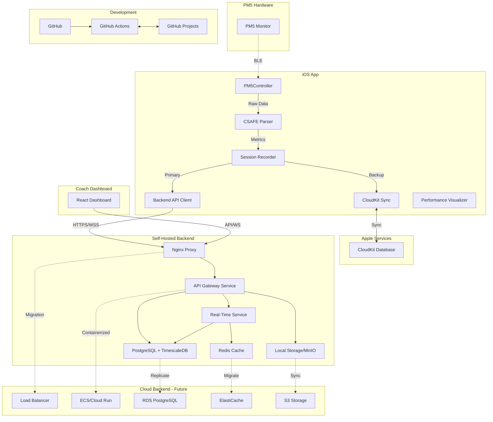

# Components

## iOS App Components

### **PM5Controller (Existing)**
**Responsibility:** Manages all Bluetooth Low Energy communications with PM5 monitors, handles device discovery, connection management, and data streaming

**Key Interfaces:** (From existing `d_n_w/PM5/PM5Controller.swift`)
- `startScanning()` - Discover PM5 devices
- `connect(to: CBPeripheral)` - Connect to PM5
- `@Published var rowingData: PM5RowingData` - Live metrics stream
- `@Published var connectionState: ConnectionState` - Connection status

**Dependencies:** CoreBluetooth framework, CSAFEProtocol parser

**Technology Stack:** Swift, CoreBluetooth, Combine

### **CSAFEProtocol (Existing)**
**Responsibility:** Implements CSAFE protocol for PM5 communication

**Key Interfaces:** (From existing `d_n_w/PM5/CSAFEProtocol.swift`)
- `CSAFEFrame.buildFrame()` - Construct CSAFE frames
- `CSAFEParser.parse(_:)` - Parse PM5 responses
- `calculateChecksum(_:)` - Validate data integrity

**Dependencies:** Foundation framework

**Technology Stack:** Pure Swift implementation

### **PM5DataModels (Existing)**
**Responsibility:** Data structures for all PM5 metrics

**Key Interfaces:** (From existing `d_n_w/PM5/PM5DataModels.swift`)
- `GeneralStatus` - Core rowing metrics
- `StrokeData` - Detailed stroke information
- `AdditionalStatus1/2` - Extended metrics

**Dependencies:** None (pure Swift structs)

**Technology Stack:** Swift value types

### **CloudKit Sync Manager**
**Responsibility:** Handles all CloudKit operations including data persistence, sync, conflict resolution, and offline queue management

**Key Interfaces:**
- `saveSession(session: RowingSession) -> Future<CKRecord, Error>`
- `fetchRecentSessions(athleteId: String) -> [RowingSession]`
- `syncOfflineQueue() -> Future<SyncResult, Error>`
- `subscribeToChanges() -> AnyPublisher<CloudKitChange, Never>`

**Dependencies:** CloudKit framework, Network monitor

**Technology Stack:** Swift, CloudKit, Core Data (for offline cache)

### **Backend API Client**
**Responsibility:** Handles REST API and WebSocket communications with self-hosted/cloud backend

**Key Interfaces:**
- `configureEndpoint(baseURL: String, wsURL: String)`
- `authenticate(credentials: Credentials) -> Future<AuthToken, Error>`
- `createSession(session: SessionData) -> Future<SessionResponse, Error>`
- `connectWebSocket() -> WebSocketConnection`
- `streamMetrics(metrics: PM5Metrics) -> Void`

**Dependencies:** URLSession, Network framework

**Technology Stack:** Swift, URLSession, Combine

### **Performance Visualizer**
**Responsibility:** Renders real-time performance data with device-appropriate complexity

**Key Interfaces:**
- `renderPowerCurve(data: [PowerPoint]) -> SwiftUI.View`
- `animateStrokeFlow(rate: Int, phase: StrokePhase) -> SwiftUI.View`
- `displayMetricsGrid(metrics: PM5Metrics) -> SwiftUI.View`
- `getOptimalVisualization(for device: DeviceCapabilities) -> VisualizationType`

**Dependencies:** SwiftUI, Core Animation, Metal (optional)

**Technology Stack:** SwiftUI with UIKit fallbacks, custom chart implementation for iOS 15

### **Session Recorder**
**Responsibility:** Manages session lifecycle, records performance data streams, handles start/stop/pause logic

**Key Interfaces:**
- `startSession(athlete: Athlete, machine: PM5Device) -> SessionHandle`
- `recordMetrics(metrics: PM5Metrics) -> Void`
- `endSession() -> RowingSession`
- `pauseSession() -> Void`

**Dependencies:** CloudKit Sync Manager, Backend API Client, PM5Controller

**Technology Stack:** Swift, Combine, Core Data

## Backend Components (Self-Hosted/Cloud Portable)

### **API Gateway Service**
**Responsibility:** Single entry point for all API requests, handles routing, authentication, rate limiting

**Key Interfaces:**
- `POST /api/auth/login` - Authenticate user
- `GET /api/sessions` - Fetch sessions with filtering
- `POST /api/sessions` - Create new session
- `WS /ws/live/:sessionId` - WebSocket for live streaming
- `GET /api/teams/:teamId/dashboard` - Coach dashboard data

**Dependencies:** PostgreSQL connection pool, Redis cache, JWT library

**Technology Stack:** 
- Self-hosted: Node.js/Fastify in Docker container
- Cloud: Same container in ECS/Cloud Run/Azure Container Instances

### **Real-Time Processing Service**
**Responsibility:** Processes incoming metric streams, calculates aggregates, manages coach subscriptions

**Key Interfaces:**
- `processMetricsBatch(batch: MetricsBatch) -> ProcessingResult`
- `calculateAggregates(sessionId: String, window: TimeWindow) -> Aggregates`
- `broadcastToCoaches(teamId: String, data: TeamMetrics)`
- `detectAnomalies(metrics: PM5Metrics) -> Alert[]`

**Dependencies:** TimescaleDB for time-series, Redis for pub/sub

**Technology Stack:**
- Self-hosted: Node.js/Fastify or Go/Fiber in Docker
- Cloud: Same container or serverless functions

### **Database Abstraction Layer**
**Responsibility:** Provides consistent interface regardless of deployment environment

**Key Interfaces:**
```typescript
interface DatabaseAdapter {
  connect(): Promise<Connection>
  query<T>(sql: string, params?: any[]): Promise<T[]>
  streamQuery<T>(sql: string): AsyncIterator<T>
  migrate(): Promise<void>
}
```

**Dependencies:** pg driver, migration tool (Flyway/Knex)

**Technology Stack:** TypeScript, PostgreSQL client, connection pooling

### **Storage Abstraction Service**
**Responsibility:** Unified interface for file storage across environments

**Key Interfaces:**
```typescript
interface StorageAdapter {
  upload(key: string, data: Buffer): Promise<string>
  download(key: string): Promise<Buffer>
  getSignedUrl(key: string): Promise<string>
}
```

**Dependencies:** fs (local), MinIO client, AWS SDK

**Technology Stack:** Node.js, abstracted storage clients

### **Coach Dashboard Backend**
**Responsibility:** Serves real-time and historical data to web dashboard

**Key Interfaces:**
- `GET /dashboard/api/live-sessions` - Active sessions grid
- `GET /dashboard/api/metrics/:sessionId` - Session details
- `WS /dashboard/ws/team/:teamId` - Real-time updates
- `GET /dashboard/api/export/:format` - Export data

**Dependencies:** API Gateway Service, PostgreSQL, Redis cache

**Technology Stack:** Same Node.js/Fastify container, React dashboard served via Nginx/CDN

## Infrastructure Components

### **Reverse Proxy / Load Balancer**
**Responsibility:** Routes traffic, handles SSL termination, load balancing

**Configuration:**
```nginx
upstream api_backend {
    server api-server:3000;
}
server {
    listen 443 ssl http2;
    location /api {
        proxy_pass http://api_backend;
    }
    location /ws {
        proxy_pass http://api_backend;
        proxy_http_version 1.1;
        proxy_set_header Upgrade $http_upgrade;
    }
}
```

**Cloud Migration:** Replace with ALB/CloudFront/Azure Front Door

## Development Infrastructure Components

### **GitHub MCP Integration**
**Responsibility:** Manages bi-directional sync between development workflow and GitHub Projects

**Key Interfaces:**
- MCP Tool: `github__create_issue` - Create issues with proper labels and project assignment
- MCP Tool: `github__update_issue` - Update issue status and move in project board
- MCP Tool: `github__create_pr` - Create pull requests linked to issues
- GitHub Action: `on-pr-merge` - Auto-update GitHub Projects
- Webhook: `POST /webhooks/github` - Receive GitHub events

**Dependencies:** GitHub MCP tools, GitHub Actions, GitHub Projects API

**Technology Stack:** GitHub MCP, GitHub Actions, GitHub Projects v2 API, webhooks

## Component Interaction Diagram

