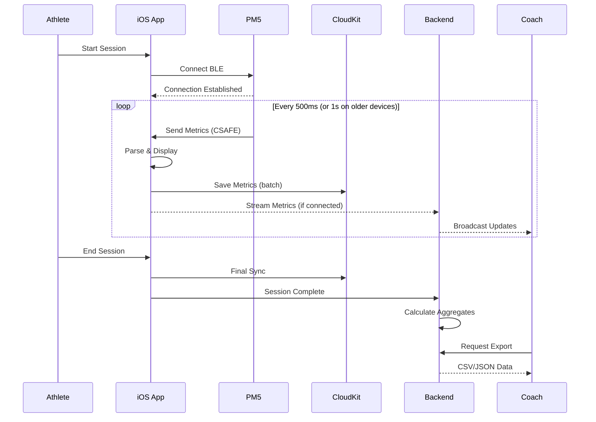
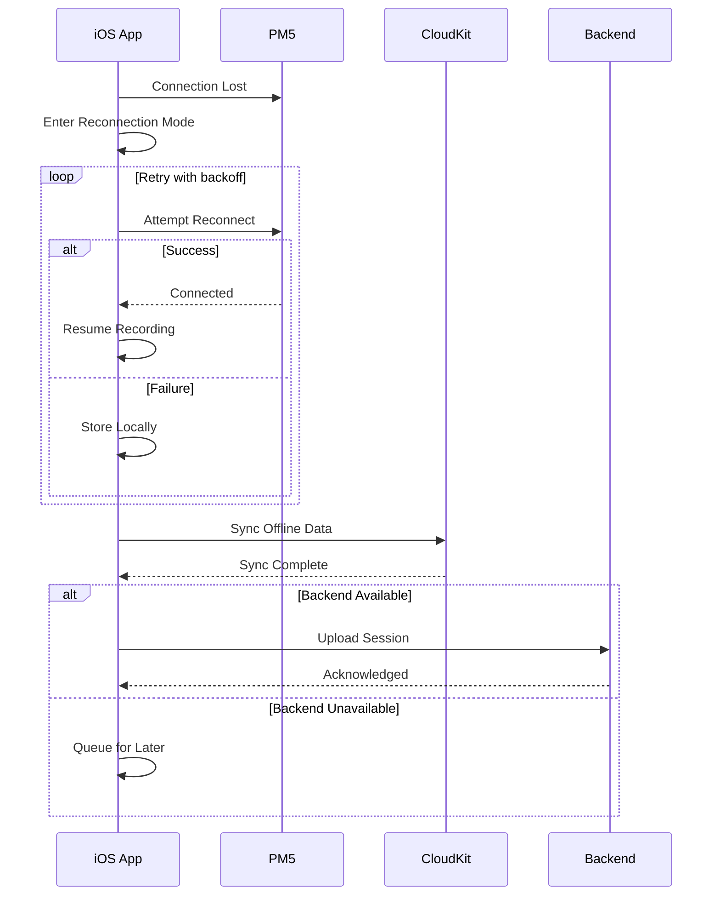

# Core Workflows

## Session Recording Workflow

```mermaid
sequenceDiagram
    participant Athlete
    participant iOS App
    participant PM5
    participant CloudKit
    participant Backend
    participant Coach

    Athlete->>iOS App: Start Session
    iOS App->>PM5: Connect BLE
    PM5-->>iOS App: Connection Established
    
    loop Every 500ms (or 1s on older devices)
        PM5->>iOS App: Send Metrics (CSAFE)
        iOS App->>iOS App: Parse & Display
        iOS App->>CloudKit: Save Metrics (batch)
        iOS App-->>Backend: Stream Metrics (if connected)
        Backend-->>Coach: Broadcast Updates
    end
    
    Athlete->>iOS App: End Session
    iOS App->>CloudKit: Final Sync
    iOS App->>Backend: Session Complete
    Backend->>Backend: Calculate Aggregates
    Coach->>Backend: Request Export
    Backend-->>Coach: CSV/JSON Data
```

## Error Recovery Workflow

```mermaid
sequenceDiagram
    participant iOS App
    participant PM5
    participant CloudKit
    participant Backend

    iOS App->>PM5: Connection Lost
    iOS App->>iOS App: Enter Reconnection Mode
    
    loop Retry with backoff
        iOS App->>PM5: Attempt Reconnect
        alt Success
            PM5-->>iOS App: Connected
            iOS App->>iOS App: Resume Recording
        else Failure
            iOS App->>iOS App: Store Locally
        end
    end
    
    iOS App->>CloudKit: Sync Offline Data
    CloudKit-->>iOS App: Sync Complete
    
    alt Backend Available
        iOS App->>Backend: Upload Session
        Backend-->>iOS App: Acknowledged
    else Backend Unavailable
        iOS App->>iOS App: Queue for Later
    end
```
