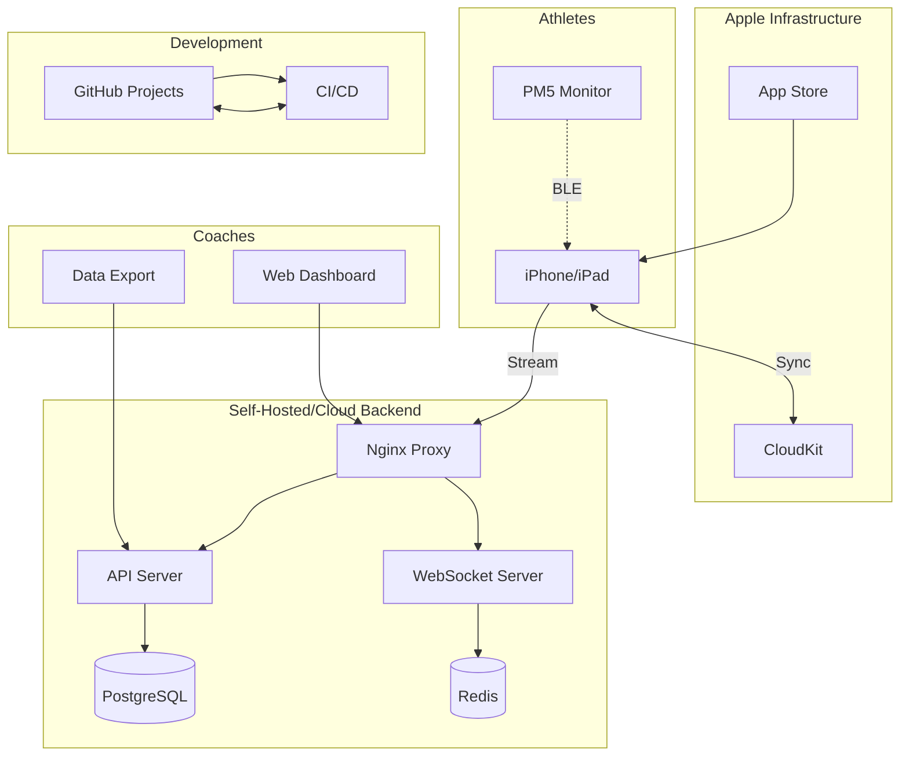

# High Level Architecture

## Technical Summary
The platform employs a hybrid architecture combining native iOS development with CloudKit for data persistence and an optional self-hosted/cloud backend for real-time coaching features. The iOS app leverages existing PM5 BLE connectivity code to capture performance metrics, while CloudKit provides zero-configuration data sync for individual athletes. For team coaching scenarios, a containerized backend (self-hosted initially, cloud-scalable) adds WebSocket streaming and coach dashboards. This pragmatic approach delivers immediate value through the iOS MVP while maintaining a clear path to advanced multi-athlete monitoring capabilities.

## Platform and Infrastructure Choice
**Platform:** Hybrid - CloudKit (MVP) + Self-Hosted Linux Server (Phase 2) → Cloud (Future)
**Key Services:** 
- MVP: CloudKit, iOS native, PM5 BLE
- Phase 2: Docker containers, PostgreSQL, Redis, Nginx
- Future: AWS ECS/RDS or Azure Container Instances

**Deployment Host and Regions:** 
- iOS App: Global via App Store
- Backend: Single Linux server (initial) → Multi-region cloud (future)

## Repository Structure
**Structure:** Monorepo with clear package boundaries
**Monorepo Tool:** Git with workspace organization
**Package Organization:**
```
rowing-platform/
├── d_n_w/                 # iOS app (existing)
├── backend/               # Self-hosted backend (Phase 2)
│   ├── api/              # REST/WebSocket server
│   ├── dashboard/        # Coach web dashboard
│   └── infrastructure/   # Docker/deployment configs
├── shared/               # Shared types/protocols
└── docs/                 # Architecture/API docs
```

## High Level Architecture Diagram


## Architectural Patterns
- **Hybrid Cloud-Native:** CloudKit for data persistence, optional backend for real-time features - *Rationale:* Minimizes infrastructure complexity while enabling advanced features
- **Container-First Deployment:** All backend services in Docker containers - *Rationale:* Ensures portability between self-hosted and cloud environments
- **Event-Driven Updates:** WebSocket for real-time metrics streaming - *Rationale:* Provides low-latency updates for coach monitoring
- **MVVM Pattern (iOS):** ViewModels manage state for SwiftUI views - *Rationale:* Clean separation of concerns and testability
- **Repository Pattern:** Abstract data access across CloudKit/Backend - *Rationale:* Enables seamless fallback and migration options
- **API Gateway Pattern:** Single entry point for all backend services - *Rationale:* Centralized auth, rate limiting, and monitoring
- **Offline-First Design:** Local caching with background sync - *Rationale:* Ensures reliability in poor network conditions
- **Progressive Enhancement (iOS):** Feature detection and graceful degradation for older devices - *Rationale:* Supports 7-8 year old devices common among students
